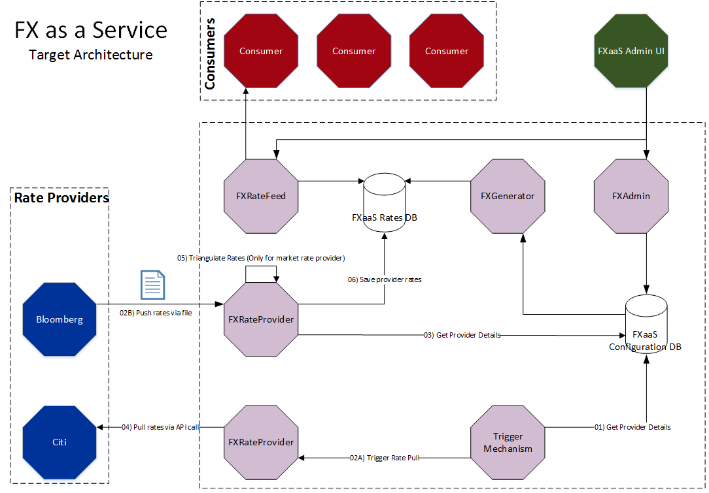
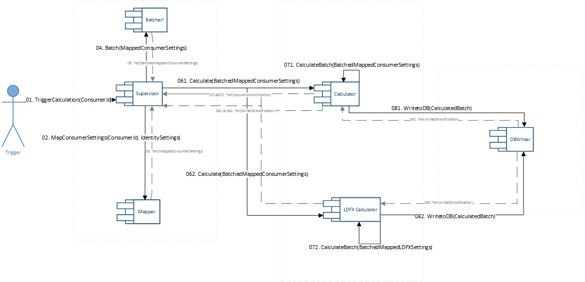

= High Level Design for Longer Term FX Rates
:toc:
:toclevels: 3

ifdef::env-github[]
:imglinkbase: https://github.devops.worldpay.local/raw/solution-architecture/HLD/master/ECB0000/img
:tip-caption: :bulb:
:note-caption: :information_source:
:important-caption: :heavy_exclamation_mark:
:caution-caption: :fire:
:warning-caption: :warning:
endif::[] 

== Introduction

=== In Scope
* Provide longer term foreign exchange rates to specific merchants 

=== Out of Scope
* FX booking service
* Managing LDFX risk on FXaaS side

== Problem Statement
Worldpay wants to provide guaranteed rates for longer periods of time for specific merchants without taking the risk on market rates changes.

== Functional View
=== Solution Outline
* To provide LDFX rates, FXaaS should extend the support multiple rate providers to identity configuration per currency pair level.
* This means all merchants would receive rates based on default rate provider and Worldpay's default calculation pattern
* Merchants with longer term agreements would receive tailored rates based on an LDFX rate provider and calculation pattern according to LDFX requirements
* The final result includes overrides
* The rates saved in the database and returned to merchants are the mix of the above 3 steps

=== Merchant Rate Configuration
To extend the concept of multiple rate provider to a granular level, merchant confiugration should be extended to support rate provider at level of consumer+merchant+payment method+currency pair

Configurations for a merchant rate calculation example:

[source, json]
----
MerchantRateConfiguration: [
	{
		"ConsumerId": "NAP",
		"Identity": "000012",
		"PaymentMethod": "000012",		
		"SourceCurrency": "USD",
		"TargetCurrency": "GBP",
		"ProfitabilityFactor": 1.12,
		"StartDate": "12-07-2018",
		"EndDate": "12-10-2018",		
		"RateProvider": "Bloomberg", 	
		"CalculationPattern": "WorldpayDefault",
		"Merhrdad Comment": "Rate provider can be left empty indicating that the rate is from default rate provider. Or by default set to default rate provider if the AdminAPI call does not include rate provider"
	},
	{
		"ConsumerId": "NAP",
		"Identity": "000012",
		"PaymentMethod": "000012",		
		"SourceCurrency": "USD",
		"TargetCurrency": "GBP",
		"ProfitabilityFactor": 1.12,
		"StartDate": "12-07-2018",
		"EndDate": "12-10-2018",		
		"RateProvider": "Citi",	
		"CalculationPattern": "CitiLDFX"
	}
]
----

=== Maintain LDFX Account Configuration
To make sure FXaaS uses the correct set of rates from LDFX rate provider, FXaaS should maintain the configuration for LDFX account based on consumer and merchant (idenity). The configuration includes the consumer, merchant, start date, end date, currency pair. Here is an example of data needed:

[source, json]
----
LDFXAccountConfiguraiton: [
	{
		"ConsumerId": "NAP",
		"Identity": "000012",
		"AccountReference": "NAP-000012",
		"SourceCurrency": "USD",
		"TargetCurrency": "GBP",
		"StartDate": "12-07-2018",
		"EndDate": "12-10-2018",		
		"LDFXProvider": "Citi",
		"Active": "True"
	}
]
----

=== LDFX Calculation
* On each calculation, FXGenerator would go through these steps:
 - Standard Calculation
 - LDFX Calculation, OverrideCode: LDFX
 - Overrides, OverrideCode: depends, e.g.: 1to1 when there is no OverrideCode 
 
* Each calculation would override or append a list of rates. So if there is a currency pair included in LDFX that is not included in standard calculation rates, the new rate should be appended to the list

* LDFX is enabled if calculation is happening on/after start date
* LDFX is ignored if calculation is happening after end date

=== MDF calculations
MDF is currently mandatory for all rates. Either MDF is optional, or FXaaS needs to support 

MDF will be calculated using LDFX rates without applying VF.
When MDF period enters the end of LDFX, MDF rates can be calculated using normal calculation and Bloomberg rates

Here is an example:

On day 1 of LDFX, rates would be:

Rates on day 1 to day 88 of 90 day LDFX period: 

[source, json]
----
CalculatedRate: {
	"Consumer": "NAP",
	"Identity": "000012",
	"SourceCurrency": "USD",
	"TargetCurrency": "GBP",
	"BuyRate": 1.35121212,
	"SellRate": 0.68121212,
	"MDF01Buy": 1.35121212,
	"MDF01Sell": 0.68121212,
	"MDF02Buy": 1.35121212,
	"MDF02Sell": 0.68121212,
	"MDF03Buy": 1.35121212,
	"MDF03Sell": 0.68121212,
	"OverrideCodes": [
		"LDFX"
	]
}
----

Rates on day 89 of 90 day LDFX period: 
[source, json]
----
CalculatedRate: {
	"Consumer": "NAP",
	"Identity": "000012",
	"SourceCurrency": "USD",
	"TargetCurrency": "GBP",
	"BuyRate": 1.35121212,
	"SellRate": 0.68121212,
	"MDF01Buy": 1.35121212,
	"MDF01Sell": 0.68121212,
	"MDF02Buy": 1.35121212,
	"MDF02Sell": 0.68121212,
	"MDF03Buy": 1.48121212,
	"MDF03BuyComment": "****This is just a comment, the field is not part of the schema! **** MDF03 falls outside of the LDFX period, therefore risk of such booking is with Worldpay and should be booked against Bloomberg rates",
	"MDF03Sell": 0.78121212,
	"OverrideCodes": [
		"LDFX"
	]
}
----

=== LDFX Rate Provider
CAUTION: Disclaimer: This section is based on Citi API details

* FXaaS would setup a new rate provider and retrieve rates from Citi. Rates provided by Citi alongside LDFX settings provide the base for FXGenereator to calculate LDFX rates. 

* Citi provides an API that FXaaS can call to perform calculations. FXaaS can call the API before each calculation. This would mean there would be no need to setup a job to retrieve rates. Rates retrieved from LDFX should be kept in the same structure as existing rate providers. To identify rates for specific merchant from the same provider, FXaaS can either:
- Setup an independent rate provider per merchant (preferred)
- Maintain a reference to merchant for LDFX rates. This means that a currency pair from same rate provider can have multiple values varying per merchant/default set

* FXGenerator would call the requestAllRates() to get all rates and only use those that are included in LDFX rates. See aggregator model for details of how to receive rates per merchant

* Aggregator Model: Rate method signature will accept "Client Account" as a parameter. Worldpay will act as an aggregator for Citi, with sub-clients setup in Citi. A client account identifier should be created using "FXaaS Consumer-Merchant/Identity Identifier"

=== Saving LDFX Rates
Retrieved LDFX Rates are identity specific. 

=== Validating LDFX Rates
* FXaaS will receive the list of all rates 
* FXaaS will validate the rates received with LDFX configuration 
* If rate received matches an LDFX configuration, proceed to LDFX calculation
 - If rate received does not match an LDFX configuration, raise an exception 
 - If an expected rate is not received from Citi, raise an exception

== LDFX Actor Overview

